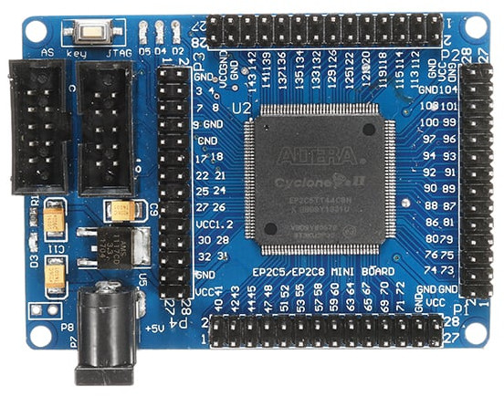
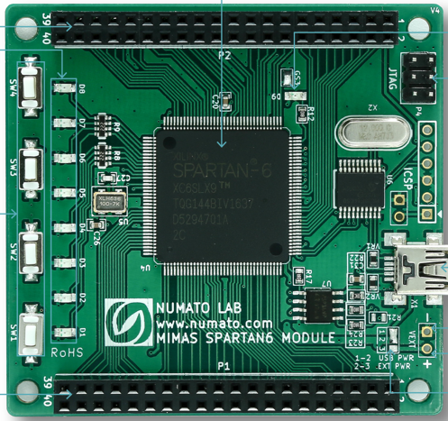
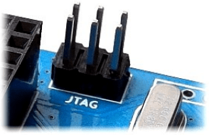
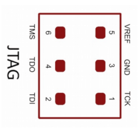
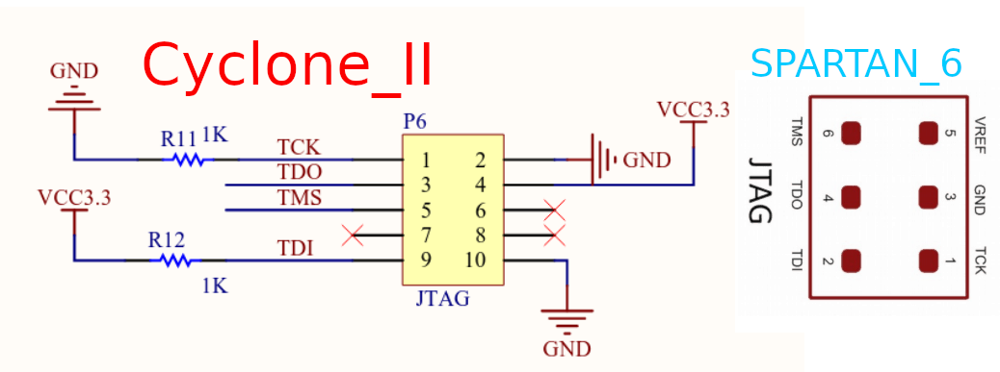

<h3 align="center">UsbBlasterAltera</h3>

<div align="center">
  
</div>


The USB-Blaster cable provides support for Passive Serial, JTAG, and Active Serial Programming modes. 


**PCB_VIEW**


<div align="center">
  
    
</div>


**Cyclone_II**


<div align="center">
  
</div>


**JTAG**

<div align="center">
  
    
</div>


**SPARTAN_6**

<div align="center">
  
</div>


**SPARTAN_6_J_TAG**

<div align="center">
  
  
</div>


<table>
  <tr>
    <th>PIN:NO</th>
    <th>FULL_FORMS</th>
    <th>Cyclone_II:SIGNAL</th>
    <th>Cyclone_II</th>
    <th>SPARTAN_6</th>
    <th>SPARTAN_6:SIGNAL</th>
  </tr>
  <tr>
  <td style="width: 50px; word-wrap: break-word;">1</td>
    <td style="width: 50px; word-wrap: break-word;">Test Clock</td>
  <td style="width: 150px; word-wrap: break-word;">TCK</td>
  <td style="width: 150px; word-wrap: break-word;">1</td>
  <td style="width: 200px; word-wrap: break-word;">1 </td>
    <td style="width: 150px; word-wrap: break-word;">TCK</td>
</tr>
  <tr>
  <td style="width: 50px; word-wrap: break-word;">2</td>
    <td style="width: 50px; word-wrap: break-word;">Ground</td>
  <td style="width: 150px; word-wrap: break-word;">GND</td>
  <td style="width: 150px; word-wrap: break-word;">2</td>
  <td style="width: 200px; word-wrap: break-word;">3 </td>
    <td style="width: 150px; word-wrap: break-word;">GND</td>
</tr>
  <tr>
  <td style="width: 50px; word-wrap: break-word;">3</td>
    <td style="width: 50px; word-wrap: break-word;"> Test Data Output</td>
  <td style="width: 150px; word-wrap: break-word;">TDO</td>
  <td style="width: 150px; word-wrap: break-word;">3</td>
  <td style="width: 200px; word-wrap: break-word;">4 </td>
    <td style="width: 150px; word-wrap: break-word;">TDO</td>
</tr>
  <tr>
  <td style="width: 50px; word-wrap: break-word;">4</td>
<td style="width: 50px; word-wrap: break-word;">Voltage Common Collector 3.3V<br>Voltage Reference</td>
  <td style="width: 150px; word-wrap: break-word;">VCC3.3</td>
  <td style="width: 150px; word-wrap: break-word;">4</td>
  <td style="width: 200px; word-wrap: break-word;">5</td>
    <td style="width: 150px; word-wrap: break-word;">VREF</td>
</tr>
  <tr>
  <td style="width: 50px; word-wrap: break-word;">5</td>
    <td style="width: 50px; word-wrap: break-word;">Test Mode Select</td>
  <td style="width: 150px; word-wrap: break-word;">TMS</td>
  <td style="width: 150px; word-wrap: break-word;">5</td>
  <td style="width: 200px; word-wrap: break-word;">6 </td>
    <td style="width: 150px; word-wrap: break-word;">TMS</td>
</tr>
  <tr>
  <td style="width: 50px; word-wrap: break-word;">6</td>
    <td style="width: 50px; word-wrap: break-word;"> Not Applicable</td>
  <td style="width: 150px; word-wrap: break-word;">NA</td>
  <td style="width: 150px; word-wrap: break-word;">NA</td>
  <td style="width: 200px; word-wrap: break-word;">NA </td>
    <td style="width: 150px; word-wrap: break-word;">NA</td>
</tr>
  <tr>
  <td style="width: 50px; word-wrap: break-word;">7</td>
    <td style="width: 50px; word-wrap: break-word;"> Not Applicable</td>
  <td style="width: 150px; word-wrap: break-word;">NA</td>
  <td style="width: 150px; word-wrap: break-word;">NA</td>
  <td style="width: 200px; word-wrap: break-word;">NA </td>
    <td style="width: 150px; word-wrap: break-word;">NA</td>
</tr>
  <tr>
  <td style="width: 50px; word-wrap: break-word;">8</td>
    <td style="width: 50px; word-wrap: break-word;"> Not Applicable</td>
  <td style="width: 150px; word-wrap: break-word;">NA</td>
  <td style="width: 150px; word-wrap: break-word;">NA</td>
  <td style="width: 200px; word-wrap: break-word;">NA </td>
    <td style="width: 150px; word-wrap: break-word;">NA</td>
</tr>
  <tr>
  <td style="width: 50px; word-wrap: break-word;">9</td>
    <td style="width: 50px; word-wrap: break-word;">Test Data Input</td>
  <td style="width: 150px; word-wrap: break-word;">TDI</td>
  <td style="width: 150px; word-wrap: break-word;">9</td>
  <td style="width: 200px; word-wrap: break-word;">2 </td>
    <td style="width: 150px; word-wrap: break-word;">TDI</td>
</tr>
  <tr>
  <td style="width: 50px; word-wrap: break-word;">10</td>
    <td style="width: 50px; word-wrap: break-word;">Ground</td>
  <td style="width: 150px; word-wrap: break-word;">GND</td>
  <td style="width: 150px; word-wrap: break-word;">10</td>
  <td style="width: 200px; word-wrap: break-word;">3 </td>
    <td style="width: 150px; word-wrap: break-word;">GND</td>
</tr>
</table>


<div align="center">
  
</div>


There is a challenge with the NUMATO Spartan 6 board.

It is possible to program it in the ways:

**Method 1** : Using JTAG with USB Blaster


```
https://github.com/trabucayre/openFPGALoader
```

openFPGALoader -c usb-blaster -m rio.svf


<div align="center">
  
</div>


**Method 2** : Using a USB data cable with Python code (this method requires only a .bin file).

Therefore, we need to convert the .bit file into a .bin file.


**.bit file into a .bin**

```
export PATH=$PATH:/home/sab/Xilinx/14.7/ISE_DS/ISE/bin/lin64/

promgen -b -p bin -o 1.bin -u 0 1.bit
```


```
Release 14.7 - Promgen P.20131013 (lin64)
Copyright (c) 1995-2013 Xilinx, Inc.  All rights reserved.
0x5327c (340604) bytes loaded up from 0x0
Using generated prom size of 512K
Writing file "1.bin".
Writing file "1.prm".
Writing file "1.cfi".
```


```
#Usage : python mimasconfig.py <PORT> <Binary File>
#Example (Windows) : python mimasconfig.py COM3 mimas.bin
#Example (Ubuntun 14.04) : python3 mimasconfig.py /dev/ttyACM0 mimas.bin
```


**FInd the port address**


```
sudo dmesg | grep -i "tty"
```


```
sab@SH4D0W6:~$ sudo dmesg | grep -i "tty"
[    0.007732] ACPI: SSDT 0x000000009EF19EA0 000517 (v02 INTEL  TbtTypeC 00000000 INTL 20160422)
[    0.050661] printk: console [tty0] enabled
[    3.083644] systemd[1]: Created slice system-getty.slice.
[ 9490.304969] cdc_acm 1-8:1.0: ttyACM0: USB ACM device
```


```
python3 mimasconfig.py /dev/ttyACM0 mimas.bin
```


```

https://github.com/gowenrw/BSidesDFW_2020_HHV/tree/master/code/CH552G

https://www.wch-ic.com/downloads/CH552DS1_PDF.html

```


**Convert the RIO .bit file into a .bin file.**


promgen -b -p bin -o rio.bin -u 0 rio.bit

python3 mimasconfig.py /dev/ttyACM0 rio.bin

Result:


<div align="center">
  
</div>


## FPGA Common File Formats 


<table>
  <tr>
    <th>No</th>
    <th>Format</th>
    <th>Full</th>
    <th>Purposes</th>
    <th>Use</th>
  </tr>
  <tr>
  <td style="width: 50px; word-wrap: break-word;">0</td>
  <td style="width: 150px; word-wrap: break-word;">.bit</td>
  <td style="width: 150px; word-wrap: break-word;">BIT File</td>
  <td style="width: 200px; word-wrap: break-word;">Raw bitstream file format for FPGA configuration</td>
  <td style="width: 150px; word-wrap: break-word;">Used to configure FPGA devices</td>
</tr>
  <tr>
    <td style="width: 50px; word-wrap: break-word;">1</td>
    <td style="width: 150px; word-wrap: break-word;">.bin</td>
    <td style="width: 150px; word-wrap: break-word;">Binary File</td>
    <td style="width: 200px; word-wrap: break-word;">Raw binary representation of the bitstream</td>
    <td style="width: 150px; word-wrap: break-word;">Flash programming or interfacing with bootloaders</td>
  </tr>
  <tr>
    <td style="width: 50px; word-wrap: break-word;">2</td>
    <td style="width: 150px; word-wrap: break-word;">.mcs</td>
    <td style="width: 150px; word-wrap: break-word;">MCS File</td>
    <td style="width: 200px; word-wrap: break-word;">Memory Configuration Store file</td>
    <td style="width: 150px; word-wrap: break-word;">Used for serial PROM devices or SPI flash</td>
  </tr>
  <tr>
    <td style="width: 50px; word-wrap: break-word;">3</td>
    <td style="width: 150px; word-wrap: break-word;">.hex</td>
    <td style="width: 150px; word-wrap: break-word;">HEX File</td>
    <td style="width: 200px; word-wrap: break-word;">Intel Hexadecimal object file format</td>
    <td style="width: 150px; word-wrap: break-word;">Programming devices or emulators that require the hex format</td>
  </tr>
  <tr>
    <td style="width: 50px; word-wrap: break-word;">4</td>
    <td style="width: 150px; word-wrap: break-word;">.exo</td>
    <td style="width: 150px; word-wrap: break-word;">EXO File</td>
    <td style="width: 200px; word-wrap: break-word;">Xilinx PROM file format</td>
    <td style="width: 150px; word-wrap: break-word;">For Xilinx PROM devices</td>
  </tr>
  <tr>
    <td style="width: 50px; word-wrap: break-word;">5</td>
    <td style="width: 150px; word-wrap: break-word;">.tek</td>
    <td style="width: 150px; word-wrap: break-word;">TEK File</td>
    <td style="width: 200px; word-wrap: break-word;">Tektronix HEX file</td>
    <td style="width: 150px; word-wrap: break-word;">For Tektronix programming environments</td>
  </tr>
  <tr>
    <td style="width: 50px; word-wrap: break-word;">6</td>
    <td style="width: 150px; word-wrap: break-word;">.rbt</td>
    <td style="width: 150px; word-wrap: break-word;">RBT File</td>
    <td style="width: 200px; word-wrap: break-word;">Raw bitstream text file</td>
    <td style="width: 150px; word-wrap: break-word;">Debugging or manual inspection of the bitstream in a human-readable text format</td>
  </tr>
  <tr>
    <td style="width: 50px; word-wrap: break-word;">7</td>
    <td style="width: 150px; word-wrap: break-word;">.svf</td>
    <td style="width: 150px; word-wrap: break-word;">SVF File</td>
    <td style="width: 200px; word-wrap: break-word;">Serial Vector Format</td>
    <td style="width: 150px; word-wrap: break-word;">Used for JTAG programming or testing</td>
  </tr>
  <tr>
    <td style="width: 50px; word-wrap: break-word;">8</td>
    <td style="width: 150px; word-wrap: break-word;">.xsvf</td>
    <td style="width: 150px; word-wrap: break-word;">XSVF File</td>
    <td style="width: 200px; word-wrap: break-word;">Compressed version of SVF</td>
    <td style="width: 150px; word-wrap: break-word;">Optimized for JTAG programming</td>
  </tr>
  <tr>
    <td style="width: 50px; word-wrap: break-word;">9</td>
    <td style="width: 150px; word-wrap: break-word;">.coe</td>
    <td style="width: 150px; word-wrap: break-word;">COE File</td>
    <td style="width: 200px; word-wrap: break-word;">Coefficient file for initializing memory or cores</td>
    <td style="width: 150px; word-wrap: break-word;">Used to load data into FPGA BRAM or custom cores</td>
  </tr>
  <tr>
    <td style="width: 50px; word-wrap: break-word;">10</td>
    <td style="width: 150px; word-wrap: break-word;">.binx</td>
    <td style="width: 150px; word-wrap: break-word;">BINX File</td>
    <td style="width: 200px; word-wrap: break-word;">Binary file with extra formatting for specific devices</td>
    <td style="width: 150px; word-wrap: break-word;">Used for flash memory programming with specific tools</td>
  </tr>
  <tr>
    <td style="width: 50px; word-wrap: break-word;">11</td>
    <td style="width: 150px; word-wrap: break-word;">.ucf</td>
    <td style="width: 150px; word-wrap: break-word;">UCF File</td>
    <td style="width: 200px; word-wrap: break-word;">User Constraint File</td>
    <td style="width: 150px; word-wrap: break-word;">Constraints file for FPGA implementation, sometimes derived from design configurations</td>
  </tr>
  <tr>
    <td style="width: 50px; word-wrap: break-word;">12</td>
    <td style="width: 150px; word-wrap: break-word;">.prm</td>
    <td style="width: 150px; word-wrap: break-word;">PRM File</td>
    <td style="width: 200px; word-wrap: break-word;">PROM file format</td>
    <td style="width: 150px; word-wrap: break-word;">Programming PROM devices in daisy-chain configurations</td>
  </tr>
  <tr>
  <td style="width: 50px; word-wrap: break-word;">13</td>
  <td style="width: 150px; word-wrap: break-word;">.pof</td>
  <td style="width: 150px; word-wrap: break-word;">POF File</td>
  <td style="width: 200px; word-wrap: break-word;">Programming Object File</td>
  <td style="width: 150px; word-wrap: break-word;">Used for programming FPGA devices, specifically in Intel FPGAs (formerly Altera)</td>
</tr>
<tr>
  <td style="width: 50px; word-wrap: break-word;">14</td>
  <td style="width: 150px; word-wrap: break-word;">.sof</td>
  <td style="width: 150px; word-wrap: break-word;">SOF File</td>
  <td style="width: 200px; word-wrap: break-word;">SRAM Object File</td>
  <td style="width: 150px; word-wrap: break-word;">Used to configure the logic of an FPGA with the design bitstream for in-system programming</td>
</tr>
</table>


