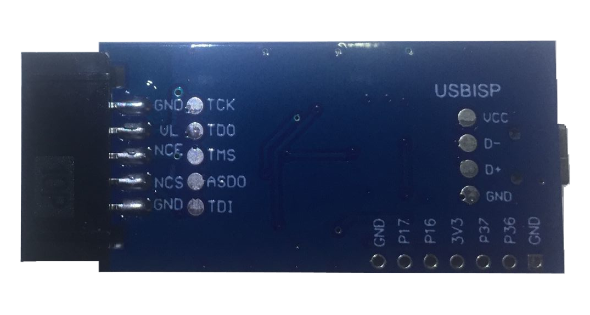

<h3 align="center">UsbBlasterAltera</h3>

<div align="center">
  
</div>


The USB-Blaster cable provides support for Passive Serial, JTAG, and Active Serial Programming modes. 


**JTAG**

<div align="center">
  
    
</div>


**PCB_VIEW**


<div align="center">
  
    
</div>


```

https://github.com/gowenrw/BSidesDFW_2020_HHV/tree/master/code/CH552G

https://www.wch-ic.com/downloads/CH552DS1_PDF.html

```


## FPGA Common File Formats 


<table>
  <tr>
    <th>No</th>
    <th>Format</th>
    <th>Full</th>
    <th>Purposes</th>
    <th>Use</th>
  </tr>
  <tr>
  <td style="width: 50px; word-wrap: break-word;">0</td>
  <td style="width: 150px; word-wrap: break-word;">.bit</td>
  <td style="width: 150px; word-wrap: break-word;">BIT File</td>
  <td style="width: 200px; word-wrap: break-word;">Raw bitstream file format for FPGA configuration</td>
  <td style="width: 150px; word-wrap: break-word;">Used to configure FPGA devices</td>
</tr>
  <tr>
    <td style="width: 50px; word-wrap: break-word;">1</td>
    <td style="width: 150px; word-wrap: break-word;">.bin</td>
    <td style="width: 150px; word-wrap: break-word;">Binary File</td>
    <td style="width: 200px; word-wrap: break-word;">Raw binary representation of the bitstream</td>
    <td style="width: 150px; word-wrap: break-word;">Flash programming or interfacing with bootloaders</td>
  </tr>
  <tr>
    <td style="width: 50px; word-wrap: break-word;">2</td>
    <td style="width: 150px; word-wrap: break-word;">.mcs</td>
    <td style="width: 150px; word-wrap: break-word;">MCS File</td>
    <td style="width: 200px; word-wrap: break-word;">Memory Configuration Store file</td>
    <td style="width: 150px; word-wrap: break-word;">Used for serial PROM devices or SPI flash</td>
  </tr>
  <tr>
    <td style="width: 50px; word-wrap: break-word;">3</td>
    <td style="width: 150px; word-wrap: break-word;">.hex</td>
    <td style="width: 150px; word-wrap: break-word;">HEX File</td>
    <td style="width: 200px; word-wrap: break-word;">Intel Hexadecimal object file format</td>
    <td style="width: 150px; word-wrap: break-word;">Programming devices or emulators that require the hex format</td>
  </tr>
  <tr>
    <td style="width: 50px; word-wrap: break-word;">4</td>
    <td style="width: 150px; word-wrap: break-word;">.exo</td>
    <td style="width: 150px; word-wrap: break-word;">EXO File</td>
    <td style="width: 200px; word-wrap: break-word;">Xilinx PROM file format</td>
    <td style="width: 150px; word-wrap: break-word;">For Xilinx PROM devices</td>
  </tr>
  <tr>
    <td style="width: 50px; word-wrap: break-word;">5</td>
    <td style="width: 150px; word-wrap: break-word;">.tek</td>
    <td style="width: 150px; word-wrap: break-word;">TEK File</td>
    <td style="width: 200px; word-wrap: break-word;">Tektronix HEX file</td>
    <td style="width: 150px; word-wrap: break-word;">For Tektronix programming environments</td>
  </tr>
  <tr>
    <td style="width: 50px; word-wrap: break-word;">6</td>
    <td style="width: 150px; word-wrap: break-word;">.rbt</td>
    <td style="width: 150px; word-wrap: break-word;">RBT File</td>
    <td style="width: 200px; word-wrap: break-word;">Raw bitstream text file</td>
    <td style="width: 150px; word-wrap: break-word;">Debugging or manual inspection of the bitstream in a human-readable text format</td>
  </tr>
  <tr>
    <td style="width: 50px; word-wrap: break-word;">7</td>
    <td style="width: 150px; word-wrap: break-word;">.svf</td>
    <td style="width: 150px; word-wrap: break-word;">SVF File</td>
    <td style="width: 200px; word-wrap: break-word;">Serial Vector Format</td>
    <td style="width: 150px; word-wrap: break-word;">Used for JTAG programming or testing</td>
  </tr>
  <tr>
    <td style="width: 50px; word-wrap: break-word;">8</td>
    <td style="width: 150px; word-wrap: break-word;">.xsvf</td>
    <td style="width: 150px; word-wrap: break-word;">XSVF File</td>
    <td style="width: 200px; word-wrap: break-word;">Compressed version of SVF</td>
    <td style="width: 150px; word-wrap: break-word;">Optimized for JTAG programming</td>
  </tr>
  <tr>
    <td style="width: 50px; word-wrap: break-word;">9</td>
    <td style="width: 150px; word-wrap: break-word;">.coe</td>
    <td style="width: 150px; word-wrap: break-word;">COE File</td>
    <td style="width: 200px; word-wrap: break-word;">Coefficient file for initializing memory or cores</td>
    <td style="width: 150px; word-wrap: break-word;">Used to load data into FPGA BRAM or custom cores</td>
  </tr>
  <tr>
    <td style="width: 50px; word-wrap: break-word;">10</td>
    <td style="width: 150px; word-wrap: break-word;">.binx</td>
    <td style="width: 150px; word-wrap: break-word;">BINX File</td>
    <td style="width: 200px; word-wrap: break-word;">Binary file with extra formatting for specific devices</td>
    <td style="width: 150px; word-wrap: break-word;">Used for flash memory programming with specific tools</td>
  </tr>
  <tr>
    <td style="width: 50px; word-wrap: break-word;">11</td>
    <td style="width: 150px; word-wrap: break-word;">.ucf</td>
    <td style="width: 150px; word-wrap: break-word;">UCF File</td>
    <td style="width: 200px; word-wrap: break-word;">User Constraint File</td>
    <td style="width: 150px; word-wrap: break-word;">Constraints file for FPGA implementation, sometimes derived from design configurations</td>
  </tr>
  <tr>
    <td style="width: 50px; word-wrap: break-word;">12</td>
    <td style="width: 150px; word-wrap: break-word;">.prm</td>
    <td style="width: 150px; word-wrap: break-word;">PRM File</td>
    <td style="width: 200px; word-wrap: break-word;">PROM file format</td>
    <td style="width: 150px; word-wrap: break-word;">Programming PROM devices in daisy-chain configurations</td>
  </tr>
  <tr>
  <td style="width: 50px; word-wrap: break-word;">13</td>
  <td style="width: 150px; word-wrap: break-word;">.pof</td>
  <td style="width: 150px; word-wrap: break-word;">POF File</td>
  <td style="width: 200px; word-wrap: break-word;">Programming Object File</td>
  <td style="width: 150px; word-wrap: break-word;">Used for programming FPGA devices, specifically in Intel FPGAs (formerly Altera)</td>
</tr>
<tr>
  <td style="width: 50px; word-wrap: break-word;">14</td>
  <td style="width: 150px; word-wrap: break-word;">.sof</td>
  <td style="width: 150px; word-wrap: break-word;">SOF File</td>
  <td style="width: 200px; word-wrap: break-word;">SRAM Object File</td>
  <td style="width: 150px; word-wrap: break-word;">Used to configure the logic of an FPGA with the design bitstream for in-system programming</td>
</tr>
</table>


